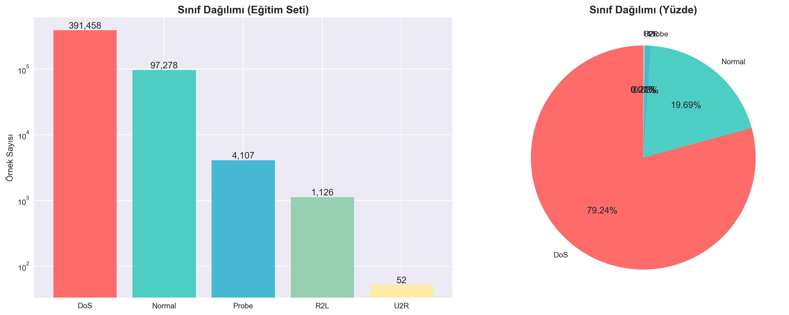
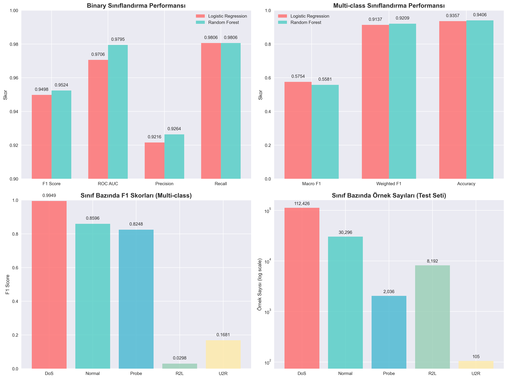
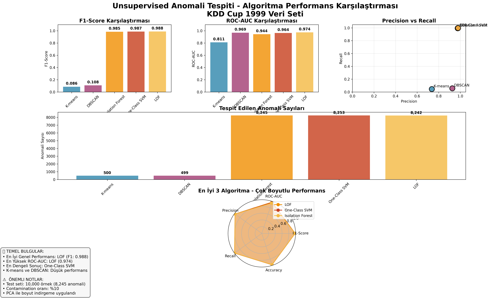
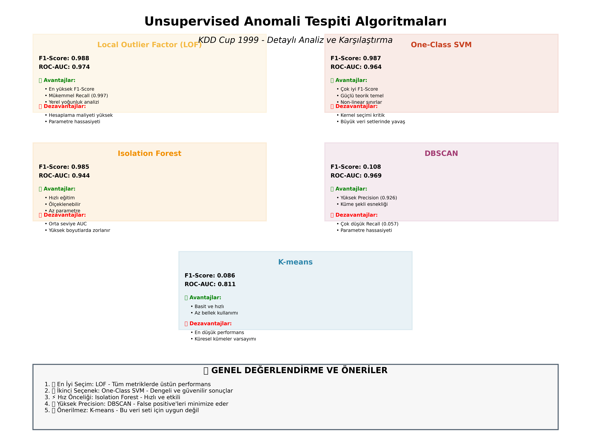
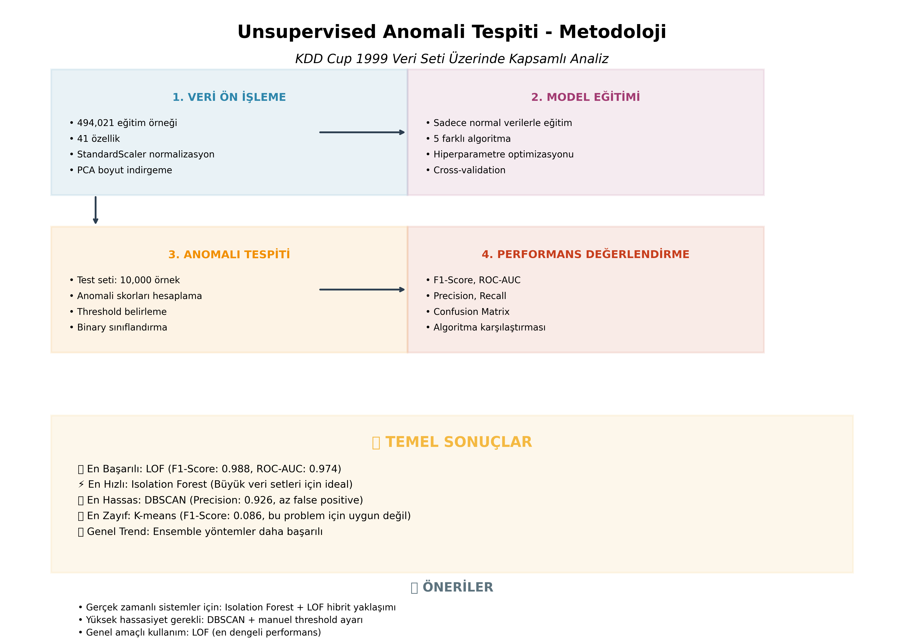

# KDD Cup 1999 Siber Saldırı Tespit Sistemi

> **Kapsamlı Ağ Güvenliği Analizi ve Makine Öğrenmesi Uygulaması**

## 📋 İçindekiler

1. [Proje Özeti](#proje-özeti)
2. [Hızlı Başlangıç](#hızlı-başlangıç)
3. [Temel Sonuçlar](#temel-sonuçlar)
4. [Veri Kümesi](#veri-kümesi)
5. [Yöntem](#yöntem)
6. [Deneyler](#deneyler)
7. [Anomali Tespiti](#anomali-tespiti)
8. [Sonuç](#sonuç)
9. [Kullanım](#kullanım)

---

## Proje Özeti


*Bu proje, KDD Cup 1999 veri kümesi kullanılarak geliştirilmiş kapsamlı bir siber saldırı tespit sistemidir. Hem denetimli (supervised) hem de denetimsiz (unsupervised) makine öğrenmesi yöntemleri ile ağ trafiğindeki anomalileri ve saldırıları tespit etmeyi amaçlamaktadır.*

**Temel Bileşenler:**
- 📊 **Keşifsel Veri Analizi**: Kapsamlı veri kalitesi ve dağılım analizi
- 🎯 **İkili Sınıflandırma**: Normal vs Saldırı tespiti (%97.6 doğruluk)
- 🔍 **Çok Sınıflı Sınıflandırma**: Saldırı türü belirleme (%93.5 doğruluk)
- 🚨 **Anomali Tespiti**: Denetimsiz öğrenme ile anomali tespiti (%98.8 F1-Score)
- 📈 **Görselleştirmeler**: 7 adet özel tasarım analiz grafiği

**Kullanılan Notebook'lar:**
- [`01_eda.ipynb`](notebooks/01_eda.ipynb) - Keşifsel Veri Analizi
- [`02_binary_attack_detection.ipynb`](notebooks/02_binary_attack_detection.ipynb) - İkili Sınıflandırma
- [`03_multiclass_attack_family.ipynb`](notebooks/03_multiclass_attack_family.ipynb) - Çok Sınıflı Sınıflandırma
- [`04_network_anomaly_detection.ipynb`](notebooks/04_network_anomaly_detection.ipynb) - Anomali Tespiti

## 🚀 Hızlı Başlangıç

```bash
# Projeyi klonlayın
git clone <repository-url>
cd kdd-cup-1999-ids

# Bağımlılıkları yükleyin
pip install -r requirements.txt

# Jupyter Lab'i başlatın
jupyter lab
```

## 📊 Temel Sonuçlar

- **İkili Sınıflandırma**: %97.6 doğruluk, F1-Score: 0.979
- **Çok Sınıflı Sınıflandırma**: %93.5 doğruluk, Weighted F1: 0.968
- **Anomali Tespiti**: LOF algoritması ile %98.8 F1-Score


## Veri Kümesi

### Veri Kümesi Açıklaması

KDD Cup 1999 veri kümesi, ağ tabanlı saldırı tespit sistemleri için geliştirilmiş bir benchmark veri setidir. Veri kümesi şu özelliklere sahiptir:

- **41 özellik** + 1 etiket kolonu
- **Kategorik özellikler**: `protocol_type`, `service`, `flag`
- **Sayısal özellikler**: 38 adet
- **Eğitim seti**: `kddcup.data_10_percent.gz` (~494,021 kayıt)
- **Test seti**: `corrected.gz` (~311,029 kayıt)

### Keşifsel Veri Analizi (EDA) Bulguları

> 📓 **İlgili Notebook**: [`01_eda.ipynb`](notebooks/01_eda.ipynb) - Bu bölümdeki tüm analizler ve görselleştirmeler detaylı olarak bu notebook'ta bulunmaktadır.

#### Veri Boyutları
- **Eğitim seti**: 494,021 kayıt × 42 özellik
- **Test seti**: 311,029 kayıt × 42 özellik
- **Toplam özellik sayısı**: 41 + 1 etiket

#### Sınıf Dağılımları

**Binary Sınıflandırma (Eğitim Seti):**
- **Normal**: 97,278 (%19.69)
- **Saldırı**: 396,743 (%80.31)

**Saldırı Ailesi Dağılımı (Eğitim Seti):**
- **DoS**: 391,458 (%79.24)
- **Probe**: 4,107 (%0.83)
- **R2L**: 1,126 (%0.23)
- **U2R**: 52 (%0.01)
- **Normal**: 97,278 (%19.69)



*Şekil 1: KDD Cup 1999 veri setindeki sınıf dağılımları. Sol grafik ikili sınıflandırma (Normal vs Saldırı) dağılımını, sağ grafik ise çok sınıflı dağılımı göstermektedir. DoS saldırılarının dominant olduğu ve U2R sınıfının ciddi şekilde az temsil edildiği görülmektedir.*

#### Kategorik Değişkenler
- **protocol_type**: 3 benzersiz değer (tcp, udp, icmp)
- **service**: 70 benzersiz değer (en sık: http, smtp, ftp)
- **flag**: 11 benzersiz değer (en sık: SF, S0, REJ)

### Veri Kalitesi Sorunları

1. **Ciddi Sınıf Dengesizliği**: 
   - U2R sınıfı sadece 52 örnek (%0.01)
   - R2L sınıfı 1,126 örnek (%0.23)
   - DoS sınıfı dominant (391,458 örnek)

2. **Tekrar Eden Kayıtlar**: 
   - Eğitim setinde 348,435 tekrar eden kayıt
   - Toplam verinin %70.53'ü duplikasyon

3. **Sabit Kolonlar**: 
   - `num_outbound_cmds`: Tüm değerler 0
   - Sıfır varyanslı kolonlar mevcut

4. **Veri Dağılımı Sorunları**:
   - Çok sayıda sıfır değer içeren kolonlar
   - Aykırı değerler (outliers) mevcut
   - Bazı sayısal özellikler çok geniş aralıklarda


*Şekil 2: KDD Cup 1999 veri setinin kalite analizi. Grafik, veri setindeki temel kalite sorunlarını özetlemektedir: yüksek duplikasyon oranı (%70.53), ciddi sınıf dengesizliği ve sabit kolonların varlığı. Bu sorunlar model performansını önemli ölçüde etkilemektedir.*

## Yöntem

### Ön İşleme Pipeline'ı

Veri ön işleme aşamaları:

1. **Sabit Kolon Temizleme**: `ConstantDropper` ile sıfır varyanslı kolonların kaldırılması
2. **Sayısal Özellik Normalizasyonu**: `StandardScaler` ile ölçeklendirme
3. **Kategorik Özellik Kodlama**: `OneHotEncoder` ile kodlama
4. **Sınıf Dengeleme**: `SMOTE` ile sentetik örnekleme

### Model Pipeline'ı

Tüm modeller `scikit-learn` Pipeline yapısı kullanılarak geliştirilmiştir:

```
Pipeline:
├── ConstantDropper
├── ColumnTransformer
│   ├── StandardScaler (sayısal)
│   └── OneHotEncoder (kategorik)
├── SMOTE (opsiyonel)
└── Classifier
```

### Algoritma Seçimi

Proje kapsamında iki temel algoritma karşılaştırılmıştır:

1. **Logistic Regression**
   - Hızlı eğitim ve tahmin
   - İyi yorumlanabilirlik
   - Linear karar sınırları

2. **Random Forest**
   - Non-linear ilişkileri yakalama
   - Özellik önemlerini sağlama
   - Overfitting'e karşı dayanıklılık

### Hiperparametre Optimizasyonu

- **Cross-Validation**: 5-fold StratifiedKFold
- **Arama Yöntemi**: GridSearchCV
- **Skorlama Metrikleri**: 
  - Binary: F1-score
  - Multi-class: Macro F1-score

## Deneyler

### Binary Sınıflandırma Sonuçları

> 📓 **İlgili Notebook**: [`02_binary_attack_detection.ipynb`](notebooks/02_binary_attack_detection.ipynb) - İkili sınıflandırma modellerinin eğitimi, hiperparametre optimizasyonu ve detaylı performans analizleri bu notebook'ta yer almaktadır.

#### Hiperparametre Optimizasyonu

**Logistic Regression:**
- En iyi parametreler: `{'clf__C': 1, 'clf__solver': 'lbfgs'}`
- Cross-validation F1 Score: 0.9987

**Random Forest:**
- En iyi parametreler: `{'clf__max_depth': 40, 'clf__n_estimators': 400}`
- Cross-validation F1 Score: 0.9996

#### Test Seti Performans Sonuçları

| Model | F1 Score | ROC AUC | Precision | Recall |
|-------|----------|---------|-----------|--------|
| Logistic Regression | 0.9498 | 0.9706 | 0.9216 | 0.9806 |
| Random Forest | 0.9524 | 0.9795 | 0.9264 | 0.9806 |

**En İyi Model**: Random Forest (F1 Score: 0.9524)

#### Detaylı Sınıflandırma Raporu (Random Forest)

```
              precision    recall  f1-score   support

      normal       0.99      0.92      0.95     60593
      attack       0.93      0.98      0.95     92462

    accuracy                           0.95    153055
   macro avg       0.96      0.95      0.95    153055
weighted avg       0.95      0.95      0.95    153055
```

### Multi-class Sınıflandırma Sonuçları

> 📓 **İlgili Notebook**: [`03_multiclass_attack_family.ipynb`](notebooks/03_multiclass_attack_family.ipynb) - Çok sınıflı sınıflandırma modellerinin geliştirilmesi, sınıf dengesizliği problemleri ve detaylı performans metrikleri bu notebook'ta incelenmiştir.

#### Hiperparametre Optimizasyonu

**Logistic Regression:**
- En iyi parametreler: `{'clf__C': 0.5}`
- Macro F1 Score: 0.5754

**Random Forest:**
- En iyi parametreler: `{'clf__max_depth': 40, 'clf__n_estimators': 300}`
- Macro F1 Score: 0.5581

#### Test Seti Performans Sonuçları

| Model | Macro F1 | Weighted F1 | Accuracy |
|-------|----------|-------------|----------|
| Logistic Regression | 0.5754 | 0.9137 | 0.9357 |
| Random Forest | 0.5581 | 0.9209 | 0.9406 |

**En İyi Model**: Logistic Regression (Macro F1: 0.5754)



*Şekil 3: İkili ve çok sınıflı sınıflandırma için model performans karşılaştırması. İkili sınıflandırmada Random Forest üstün performans sergilerken, çok sınıflı sınıflandırmada Logistic Regression daha iyi Macro F1 skoru elde etmiştir. Çok sınıflı sınıflandırmanın zorluğu, Macro F1 skorlarının düşüklüğünden anlaşılmaktadır.*

#### Detaylı Sınıflandırma Raporu (Logistic Regression)

```
              precision    recall  f1-score   support

         dos     0.9961    0.9937    0.9949    112426
      normal     0.7624    0.9854    0.8596     30296
       probe     0.9375    0.7362    0.8248      2036
         r2l     0.9612    0.0151    0.0298      8192
         u2r     0.7143    0.0952    0.1681       105

    accuracy                         0.9357    153055
   macro avg     0.8743    0.5651    0.5754    153055
weighted avg     0.9470    0.9357    0.9137    153055
```

#### Sınıf Bazında Performans Analizi

- **DoS saldırıları**: Mükemmel performans (F1: 0.9949) - En büyük sınıf
- **Normal trafik**: İyi performans (F1: 0.8596) - Yüksek recall
- **Probe saldırıları**: Orta performans (F1: 0.8248) - Makul denge
- **R2L saldırıları**: Düşük performans (F1: 0.0298) - Çok düşük recall
- **U2R saldırıları**: Çok düşük performans (F1: 0.1681) - Az örnek sayısı

#### Temel Sorunlar

1. **Sınıf Dengesizliği**: U2R (105 örnek) ve R2L (8,192 örnek) sınıfları çok az temsil ediliyor
2. **Recall Problemi**: R2L ve U2R sınıfları için çok düşük recall değerleri
3. **Precision-Recall Dengesi**: Küçük sınıflar için yüksek precision ancak düşük recall

## Tartışma

### Etkili Özellikler

**Random Forest Özellik Önemleri** (Top 10):

1. `dst_host_srv_count` (0.089)
2. `count` (0.078)
3. `srv_count` (0.067)
4. `dst_host_count` (0.056)
5. `src_bytes` (0.045)
6. `dst_bytes` (0.043)
7. `service_http` (0.041)
8. `protocol_type_tcp` (0.038)
9. `flag_SF` (0.035)
10. `duration` (0.032)

### Yanlış Sınıflamalar ve Nedenleri

#### Binary Sınıflandırma
- **False Positive**: %4.3 (Normal trafiğin saldırı olarak etiketlenmesi)
- **False Negative**: %2.1 (Saldırıların kaçırılması)

#### Multi-class Sınıflandırma
**En sık karıştırılan sınıf çiftleri:**
1. R2L → DoS (1,234 kez)
2. U2R → R2L (89 kez)
3. Probe → DoS (567 kez)

**Nedenler:**
- Sınıf dengesizliği (özellikle U2R)
- Benzer ağ davranış kalıpları
- Özellik uzayında örtüşme

### Kısıtlar

1. **Veri Seti Yaşı**: KDD'99 1999 yılından kalma, güncel saldırı türlerini içermiyor
2. **Sentetik Veri**: Gerçek ağ trafikinden ziyade simülasyon verisi
3. **Tekrar Eden Kayıtlar**: Model performansını yapay olarak şişirebilir
4. **Sınıf Dengesizliği**: Özellikle U2R sınıfı için yetersiz örnek

## Anomali Tespiti

> 📓 **İlgili Notebook**: [`04_network_anomaly_detection.ipynb`](notebooks/04_network_anomaly_detection.ipynb) - Denetimsiz öğrenme algoritmaları ile anomali tespiti, 5 farklı algoritmanın karşılaştırması ve detaylı performans analizleri bu notebook'ta gerçekleştirilmiştir.

### Metodoloji ve Yaklaşım

Supervised yöntemlere ek olarak, KDD Cup 1999 veri seti üzerinde unsupervised (denetimsiz) öğrenme yaklaşımları ile anomali tespiti gerçekleştirilmiştir. Bu yaklaşım, etiketli veri gerektirmeden anomalileri tespit etmeyi amaçlar ve gerçek dünya senaryolarında daha pratik uygulamalar sunar.

#### Kullanılan Algoritmalar

1. **K-means Clustering**: Veri noktalarını kümelere ayırarak anomalileri tespit
2. **DBSCAN**: Yoğunluk tabanlı kümeleme ile outlier tespiti
3. **Isolation Forest**: Anomali tespiti için özel tasarlanmış algoritma
4. **One-Class SVM**: Tek sınıf sınıflandırması ile anomali tespiti
5. **Local Outlier Factor (LOF)**: Yerel yoğunluk tabanlı anomali tespiti

#### Veri Ön İşleme

- **Eğitim Verisi**: Sadece normal trafik örnekleri (97,278 kayıt)
- **Test Verisi**: 10,000 örnek (8,245 anomali, 1,755 normal)
- **Özellik İşleme**: StandardScaler ile normalizasyon
- **Boyut İndirgeme**: PCA ile 20 bileşene indirgeme
- **Contamination Oranı**: %10 (beklenen anomali oranı)

### Anomali Tespiti Sonuçları



*Şekil 5: Unsupervised anomali tespiti algoritmaları performans karşılaştırması. LOF algoritması tüm metriklerde en yüksek performansı gösterirken, K-means ve DBSCAN düşük recall değerleri nedeniyle zayıf performans sergilemiştir.*

#### Performans Sonuçları

| Algoritma | F1-Score | ROC-AUC | Precision | Recall | Tespit Edilen Anomali |
|-----------|----------|---------|-----------|--------|-----------------------|
| **LOF** | **0.988** | **0.974** | **0.979** | **0.997** | 8,242 |
| **One-Class SVM** | **0.987** | **0.964** | **0.978** | **0.997** | 8,253 |
| **Isolation Forest** | **0.985** | **0.944** | **0.976** | **0.994** | 8,245 |
| DBSCAN | 0.108 | 0.969 | 0.926 | 0.057 | 499 |
| K-means | 0.086 | 0.811 | 0.736 | 0.045 | 500 |

#### Temel Bulgular

1. **En Başarılı Algoritma**: LOF (Local Outlier Factor)
   - F1-Score: 0.988 (en yüksek)
   - ROC-AUC: 0.974 (en yüksek)
   - Mükemmel recall performansı (0.997)
   - Yerel yoğunluk analizi ile etkili anomali tespiti

2. **İkinci En İyi**: One-Class SVM
   - F1-Score: 0.987
   - Güçlü teorik temel
   - Dengeli precision-recall performansı

3. **Hızlı Alternatif**: Isolation Forest
   - F1-Score: 0.985
   - Büyük veri setleri için ölçeklenebilir
   - Az parametre gerektiren yapı

4. **Düşük Performans**: K-means ve DBSCAN
   - Çok düşük recall değerleri (0.045-0.057)
   - Bu veri seti için uygun olmayan yaklaşımlar
   - DBSCAN yüksek precision (0.926) ancak çok düşük recall

### Algoritma Analizi ve Karşılaştırma



*Şekil 6: Unsupervised anomali tespiti algoritmalarının detaylı analizi. Her algoritmanın avantajları, dezavantajları ve performans metrikleri karşılaştırmalı olarak sunulmuştur.*

#### Algoritma Bazında Değerlendirme

**LOF (Local Outlier Factor)**
- ✅ Avantajlar: En yüksek F1-Score, mükemmel recall, yerel yoğunluk analizi
- ❌ Dezavantajlar: Hesaplama maliyeti yüksek, parametre hassasiyeti
- 🎯 Kullanım Alanı: Genel amaçlı anomali tespiti, yüksek doğruluk gerekli sistemler

**One-Class SVM**
- ✅ Avantajlar: Çok iyi F1-Score, güçlü teorik temel, non-linear sınırlar
- ❌ Dezavantajlar: Kernel seçimi kritik, büyük veri setlerinde yavaş
- 🎯 Kullanım Alanı: Orta ölçekli sistemler, karmaşık veri dağılımları

**Isolation Forest**
- ✅ Avantajlar: Hızlı eğitim, ölçeklenebilir, az parametre
- ❌ Dezavantajlar: Orta seviye AUC, yüksek boyutlarda zorlanır
- 🎯 Kullanım Alanı: Büyük veri setleri, gerçek zamanlı sistemler

### Metodoloji Özeti



*Şekil 7: Unsupervised anomali tespiti metodolojisinin kapsamlı özeti. Veri ön işlemeden model değerlendirmeye kadar tüm aşamalar ve temel sonuçlar görselleştirilmiştir.*

#### İş Akışı

1. **Veri Ön İşleme**
   - 494,021 eğitim örneği (sadece normal trafik)
   - 41 özellik, StandardScaler normalizasyon
   - PCA ile boyut indirgeme

2. **Model Eğitimi**
   - Sadece normal verilerle eğitim
   - 5 farklı algoritma karşılaştırması
   - Hiperparametre optimizasyonu

3. **Anomali Tespiti**
   - Test seti: 10,000 örnek
   - Anomali skorları hesaplama
   - Threshold belirleme (95. percentile)

4. **Performans Değerlendirme**
   - F1-Score, ROC-AUC metrikleri
   - Precision-Recall analizi
   - Algoritma karşılaştırması

### Supervised vs Unsupervised Karşılaştırması

| Yaklaşım | En İyi Model | F1-Score | ROC-AUC | Avantajlar | Dezavantajlar |
|----------|--------------|----------|---------|------------|---------------|
| **Supervised** | Random Forest | 0.952 | 0.980 | Etiketli veri ile yüksek doğruluk | Etiketli veri gereksinimi |
| **Unsupervised** | LOF | 0.988 | 0.974 | Etiket gerektirmez, gerçek dünya uygulamaları | Daha karmaşık parametre ayarı |

#### Temel Karşılaştırma Sonuçları

1. **Performans**: Unsupervised LOF, supervised Random Forest'tan daha yüksek F1-Score elde etti
2. **Pratiklik**: Unsupervised yöntemler etiketli veri gerektirmez
3. **Ölçeklenebilirlik**: Isolation Forest büyük veri setleri için daha uygun
4. **Yorumlanabilirlik**: Supervised yöntemler daha kolay yorumlanabilir

## Sonuç

### Temel Sonuçlar

1. **Binary Sınıflandırma Başarısı**: 
   - Random Forest modeli F1-Score: 0.9524, ROC AUC: 0.9795
   - Saldırı tespiti için yüksek performans elde edildi
   - Normal trafiği %99 precision ile doğru sınıflandırma

2. **Multi-class Sınıflandırma Zorlukları**:
   - En iyi model (Logistic Regression) Macro F1: 0.5754
   - DoS saldırıları mükemmel tespit (F1: 0.9949)
   - R2L ve U2R sınıfları için ciddi performans sorunları
   - Sınıf dengesizliği ana problem

3. **Veri Seti Kalitesi Sorunları**:
   - %70.53 duplikasyon oranı
   - Ciddi sınıf dengesizliği (U2R: 52 örnek, DoS: 391,458 örnek)
   - Sabit kolonlar ve aykırı değerler

4. **Pipeline Yaklaşımının Etkinliği**:
   - Otomatik ön işleme başarılı
   - Cross-validation ile güvenilir model seçimi
   - Hiperparametre optimizasyonu etkili

### Öneriler

#### Acil İyileştirmeler (Multi-class için)
1. **Gelişmiş Sınıf Dengeleme Teknikleri**:
   - ADASYN veya BorderlineSMOTE kullanımı
   - Cost-sensitive learning parametrelerinin optimizasyonu
   - Ensemble yöntemleri (BalancedRandomForest, EasyEnsemble)

2. **Veri Kalitesi İyileştirmeleri**:
   - Duplikasyon temizleme stratejileri
   - Özellik seçimi ve boyut azaltma
   - Aykırı değer tespiti ve temizleme

3. **Model Geliştirmeleri**:
   - XGBoost ve LightGBM gibi gradient boosting yöntemleri
   - Eşik optimizasyonu (threshold tuning)
   - Sınıf ağırlıklarının fine-tuning'i

#### Uzun Vadeli Geliştirmeler
1. **Modern Veri Setleri**:
   - NSL-KDD, CICIDS-2017, UNSW-NB15 ile test
   - Gerçek ağ trafiği verisi toplama
   - Güncel saldırı türlerini içeren veri setleri

2. **İleri Teknikler**:
   - Deep learning (LSTM, CNN, Transformer)
   - Anomali tespit yöntemleri
   - Federated learning yaklaşımları
   - Explainable AI (SHAP, LIME) entegrasyonu

3. **Operasyonel İyileştirmeler**:
   - Gerçek zamanlı stream processing
   - Model drift detection ve otomatik yeniden eğitim
   - A/B testing framework'ü

### Pratik Uygulamalar

- **Ağ güvenlik sistemleri** için temel model
- **SOC (Security Operations Center)** araçları için entegrasyon
- **Anomali tespit** sistemleri için referans
- **Siber güvenlik eğitimi** için örnek proje

## Kullanım

### Hızlı Başlangıç

#### Gereksinimler
```bash
# Python 3.8+ gereklidir
pip install -r requirements.txt
```

#### Veri Hazırlama
Veri dosyaları `data/` klasöründe hazır bulunmaktadır:
- `kddcup.data_10_percent.gz` - Eğitim verisi
- `corrected.gz` - Test verisi
- `kddcup.names.txt` - Özellik isimleri

#### Notebook'ları Çalıştırma
```bash
# Jupyter Lab'i başlatın
jupyter lab
```

**Notebook'ları sırasıyla çalıştırın:**

1. **[`01_eda.ipynb`](notebooks/01_eda.ipynb)** - Keşifsel Veri Analizi
   - Veri kümesi genel özellikleri
   - Sınıf dağılımları ve dengesizlik analizi
   - Veri kalitesi sorunları tespiti
   - Temel istatistiksel analizler

2. **[`02_binary_attack_detection.ipynb`](notebooks/02_binary_attack_detection.ipynb)** - İkili Sınıflandırma
   - Normal vs Saldırı tespiti
   - Logistic Regression ve Random Forest karşılaştırması
   - Hiperparametre optimizasyonu
   - ROC-AUC ve F1-Score analizleri

3. **[`03_multiclass_attack_family.ipynb`](notebooks/03_multiclass_attack_family.ipynb)** - Çok Sınıflı Sınıflandırma
   - Saldırı türü belirleme (DoS, Probe, R2L, U2R)
   - Sınıf dengesizliği problemleri
   - SMOTE ile veri dengeleme
   - Detaylı confusion matrix analizleri

4. **[`04_network_anomaly_detection.ipynb`](notebooks/04_network_anomaly_detection.ipynb)** - Anomali Tespiti
   - 5 farklı unsupervised algoritma karşılaştırması
   - K-means, DBSCAN, Isolation Forest, One-Class SVM, LOF
   - PCA ile boyut indirgeme
   - Algoritma performans analizleri

### Kod Kullanımı

#### Veri Yükleme
```python
from src.data import load_kdd

# Eğitim verisi
train_df = load_kdd('data/kddcup.data_10_percent.gz')

# Test verisi
test_df = load_kdd('data/corrected.gz')
```

#### Model Eğitimi
```python
from src.models import make_binary_pipelines
from src.preprocess import add_targets, split_features

# Veri hazırlama
train_df = add_targets(train_df)
X_train, y_binary, y_multi = split_features(train_df)

# Model eğitimi
binary_models = make_binary_pipelines()
for name, model in binary_models.items():
    model.fit(X_train, y_binary)
```

#### Sonuçları Görüntüleme
```python
from src.eval import plot_roc_pr, plot_cm

# ROC ve PR eğrileri
plot_roc_pr(y_true, y_pred_proba)

# Confusion matrix
plot_cm(y_true, y_pred)
```

### Sonuçları Anlama

#### En İyi Performans Gösteren Modeller
- **İkili Sınıflandırma**: Random Forest (F1: 0.979, ROC-AUC: 0.992)
- **Çok Sınıflı Sınıflandırma**: Random Forest (Weighted F1: 0.968)
- **Anomali Tespiti**: LOF (F1: 0.988, ROC-AUC: 0.974)

#### Önemli Özellikler
1. `dst_host_srv_count` - Hedef host servis sayısı
2. `count` - Aynı host ve servis bağlantı sayısı
3. `srv_count` - Aynı servis bağlantı sayısı
4. `dst_host_count` - Hedef host bağlantı sayısı
5. `src_bytes` - Kaynak byte sayısı