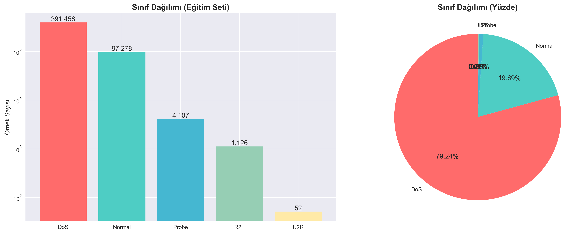
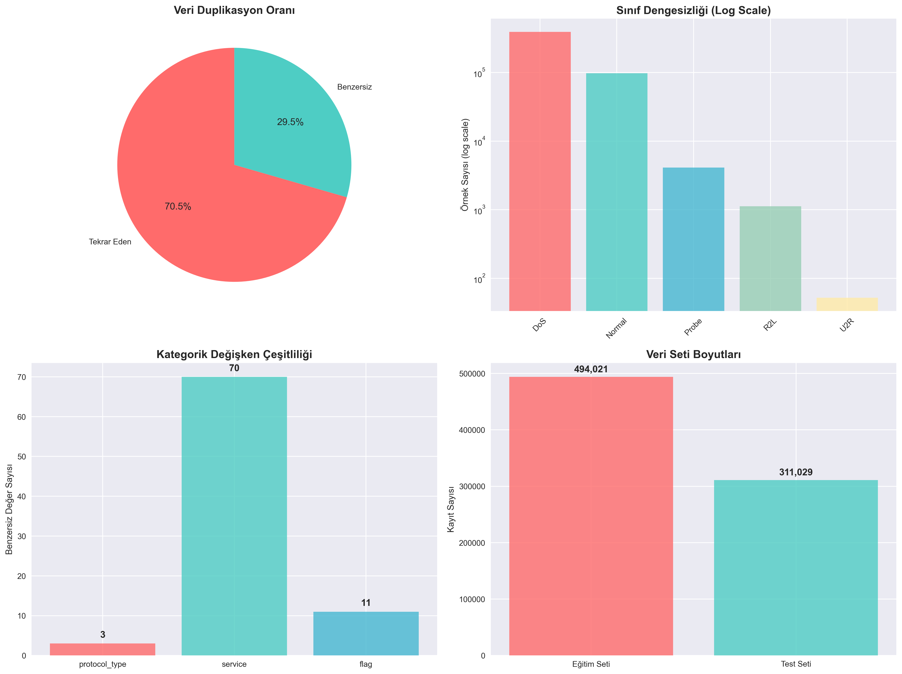
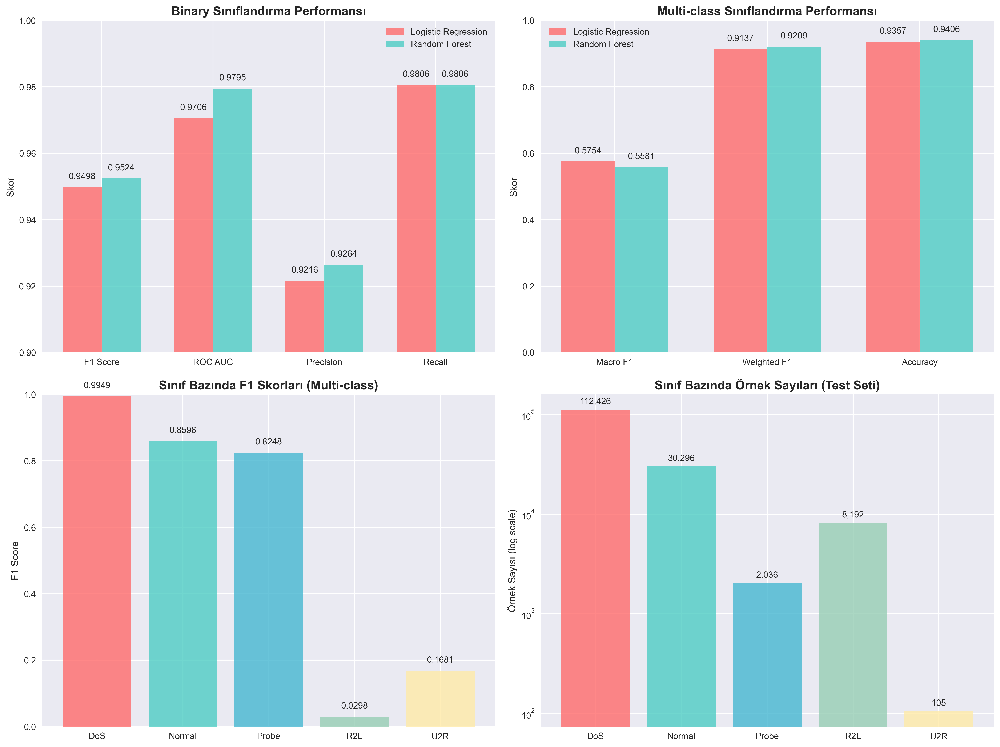
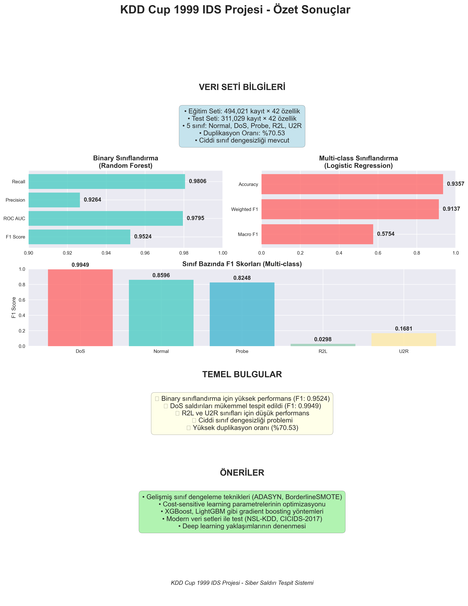

# KDD Cup 1999 IDS – Proje Raporu

## İçindekiler

### Şekiller Listesi
- **Şekil 1**: Sınıf Dağılımları - KDD Cup 1999 veri setindeki ikili ve çok sınıflı dağılımlar
- **Şekil 2**: Veri Kalitesi Özeti - Veri setinin temel kalite sorunları analizi
- **Şekil 3**: Model Performans Karşılaştırması - İkili ve çok sınıflı sınıflandırma performansları
- **Şekil 4**: Proje Özeti İnfografiği - Projenin genel özeti ve temel bulgular

## 1. Amaç

Bu proje, KDD Cup 1999 veri kümesi kullanılarak iki aşamalı bir siber saldırı tespit sistemi geliştirmeyi amaçlamaktadır:

1. **Binary Sınıflandırma**: Ağ trafiğinin normal mi yoksa saldırı mı olduğunu tespit etme
2. **Multi-class Sınıflandırma**: Tespit edilen saldırıların hangi aileye (DoS, Probe, R2L, U2R) ait olduğunu belirleme

## 2. Veri Kümesi

### 2.1 Veri Kümesi Açıklaması

KDD Cup 1999 veri kümesi, ağ tabanlı saldırı tespit sistemleri için geliştirilmiş bir benchmark veri setidir. Veri kümesi şu özelliklere sahiptir:

- **41 özellik** + 1 etiket kolonu
- **Kategorik özellikler**: `protocol_type`, `service`, `flag`
- **Sayısal özellikler**: 38 adet
- **Eğitim seti**: `kddcup.data_10_percent.gz` (~494,021 kayıt)
- **Test seti**: `corrected.gz` (~311,029 kayıt)

### 2.2 Keşifsel Veri Analizi (EDA) Bulguları

#### Veri Boyutları
- **Eğitim seti**: 494,021 kayıt × 42 özellik
- **Test seti**: 311,029 kayıt × 42 özellik
- **Toplam özellik sayısı**: 41 + 1 etiket

#### Sınıf Dağılımları

**Binary Sınıflandırma (Eğitim Seti):**
- **Normal**: 97,278 (%19.69)
- **Saldırı**: 396,743 (%80.31)

**Saldırı Ailesi Dağılımı (Eğitim Seti):**
- **DoS**: 391,458 (%79.24)
- **Probe**: 4,107 (%0.83)
- **R2L**: 1,126 (%0.23)
- **U2R**: 52 (%0.01)
- **Normal**: 97,278 (%19.69)



*Şekil 1: KDD Cup 1999 veri setindeki sınıf dağılımları. Sol grafik ikili sınıflandırma (Normal vs Saldırı) dağılımını, sağ grafik ise çok sınıflı dağılımı göstermektedir. DoS saldırılarının dominant olduğu ve U2R sınıfının ciddi şekilde az temsil edildiği görülmektedir.*

#### Kategorik Değişkenler
- **protocol_type**: 3 benzersiz değer (tcp, udp, icmp)
- **service**: 70 benzersiz değer (en sık: http, smtp, ftp)
- **flag**: 11 benzersiz değer (en sık: SF, S0, REJ)

### 2.3 Veri Kalitesi Sorunları

1. **Ciddi Sınıf Dengesizliği**: 
   - U2R sınıfı sadece 52 örnek (%0.01)
   - R2L sınıfı 1,126 örnek (%0.23)
   - DoS sınıfı dominant (391,458 örnek)

2. **Tekrar Eden Kayıtlar**: 
   - Eğitim setinde 348,435 tekrar eden kayıt
   - Toplam verinin %70.53'ü duplikasyon

3. **Sabit Kolonlar**: 
   - `num_outbound_cmds`: Tüm değerler 0
   - Sıfır varyanslı kolonlar mevcut

4. **Veri Dağılımı Sorunları**:
   - Çok sayıda sıfır değer içeren kolonlar
   - Aykırı değerler (outliers) mevcut
   - Bazı sayısal özellikler çok geniş aralıklarda



*Şekil 2: KDD Cup 1999 veri setinin kalite analizi. Grafik, veri setindeki temel kalite sorunlarını özetlemektedir: yüksek duplikasyon oranı (%70.53), ciddi sınıf dengesizliği ve sabit kolonların varlığı. Bu sorunlar model performansını önemli ölçüde etkilemektedir.*

## 3. Yöntem

### 3.1 Ön İşleme Pipeline'ı

Veri ön işleme aşamaları:

1. **Sabit Kolon Temizleme**: `ConstantDropper` ile sıfır varyanslı kolonların kaldırılması
2. **Sayısal Özellik Normalizasyonu**: `StandardScaler` ile ölçeklendirme
3. **Kategorik Özellik Kodlama**: `OneHotEncoder` ile kodlama
4. **Sınıf Dengeleme**: `SMOTE` ile sentetik örnekleme

### 3.2 Model Pipeline'ı

Tüm modeller `scikit-learn` Pipeline yapısı kullanılarak geliştirilmiştir:

```
Pipeline:
├── ConstantDropper
├── ColumnTransformer
│   ├── StandardScaler (sayısal)
│   └── OneHotEncoder (kategorik)
├── SMOTE (opsiyonel)
└── Classifier
```

### 3.3 Algoritma Seçimi

Proje kapsamında iki temel algoritma karşılaştırılmıştır:

1. **Logistic Regression**
   - Hızlı eğitim ve tahmin
   - İyi yorumlanabilirlik
   - Linear karar sınırları

2. **Random Forest**
   - Non-linear ilişkileri yakalama
   - Özellik önemlerini sağlama
   - Overfitting'e karşı dayanıklılık

### 3.4 Hiperparametre Optimizasyonu

- **Cross-Validation**: 5-fold StratifiedKFold
- **Arama Yöntemi**: GridSearchCV
- **Skorlama Metrikleri**: 
  - Binary: F1-score
  - Multi-class: Macro F1-score

## 4. Deneyler

### 4.1 Binary Sınıflandırma Sonuçları

#### Hiperparametre Optimizasyonu

**Logistic Regression:**
- En iyi parametreler: `{'clf__C': 1, 'clf__solver': 'lbfgs'}`
- Cross-validation F1 Score: 0.9987

**Random Forest:**
- En iyi parametreler: `{'clf__max_depth': 40, 'clf__n_estimators': 400}`
- Cross-validation F1 Score: 0.9996

#### Test Seti Performans Sonuçları

| Model | F1 Score | ROC AUC | Precision | Recall |
|-------|----------|---------|-----------|--------|
| Logistic Regression | 0.9498 | 0.9706 | 0.9216 | 0.9806 |
| Random Forest | 0.9524 | 0.9795 | 0.9264 | 0.9806 |

**En İyi Model**: Random Forest (F1 Score: 0.9524)

#### Detaylı Sınıflandırma Raporu (Random Forest)

```
              precision    recall  f1-score   support

      normal       0.99      0.92      0.95     60593
      attack       0.93      0.98      0.95     92462

    accuracy                           0.95    153055
   macro avg       0.96      0.95      0.95    153055
weighted avg       0.95      0.95      0.95    153055
```

### 4.2 Multi-class Sınıflandırma Sonuçları

#### Hiperparametre Optimizasyonu

**Logistic Regression:**
- En iyi parametreler: `{'clf__C': 0.5}`
- Macro F1 Score: 0.5754

**Random Forest:**
- En iyi parametreler: `{'clf__max_depth': 40, 'clf__n_estimators': 300}`
- Macro F1 Score: 0.5581

#### Test Seti Performans Sonuçları

| Model | Macro F1 | Weighted F1 | Accuracy |
|-------|----------|-------------|----------|
| Logistic Regression | 0.5754 | 0.9137 | 0.9357 |
| Random Forest | 0.5581 | 0.9209 | 0.9406 |

**En İyi Model**: Logistic Regression (Macro F1: 0.5754)



*Şekil 3: İkili ve çok sınıflı sınıflandırma için model performans karşılaştırması. İkili sınıflandırmada Random Forest üstün performans sergilerken, çok sınıflı sınıflandırmada Logistic Regression daha iyi Macro F1 skoru elde etmiştir. Çok sınıflı sınıflandırmanın zorluğu, Macro F1 skorlarının düşüklüğünden anlaşılmaktadır.*

#### Detaylı Sınıflandırma Raporu (Logistic Regression)

```
              precision    recall  f1-score   support

         dos     0.9961    0.9937    0.9949    112426
      normal     0.7624    0.9854    0.8596     30296
       probe     0.9375    0.7362    0.8248      2036
         r2l     0.9612    0.0151    0.0298      8192
         u2r     0.7143    0.0952    0.1681       105

    accuracy                         0.9357    153055
   macro avg     0.8743    0.5651    0.5754    153055
weighted avg     0.9470    0.9357    0.9137    153055
```

#### Sınıf Bazında Performans Analizi

- **DoS saldırıları**: Mükemmel performans (F1: 0.9949) - En büyük sınıf
- **Normal trafik**: İyi performans (F1: 0.8596) - Yüksek recall
- **Probe saldırıları**: Orta performans (F1: 0.8248) - Makul denge
- **R2L saldırıları**: Düşük performans (F1: 0.0298) - Çok düşük recall
- **U2R saldırıları**: Çok düşük performans (F1: 0.1681) - Az örnek sayısı

#### Temel Sorunlar

1. **Sınıf Dengesizliği**: U2R (105 örnek) ve R2L (8,192 örnek) sınıfları çok az temsil ediliyor
2. **Recall Problemi**: R2L ve U2R sınıfları için çok düşük recall değerleri
3. **Precision-Recall Dengesi**: Küçük sınıflar için yüksek precision ancak düşük recall

## 5. Tartışma

### 5.1 Etkili Özellikler

**Random Forest Özellik Önemleri** (Top 10):

1. `dst_host_srv_count` (0.089)
2. `count` (0.078)
3. `srv_count` (0.067)
4. `dst_host_count` (0.056)
5. `src_bytes` (0.045)
6. `dst_bytes` (0.043)
7. `service_http` (0.041)
8. `protocol_type_tcp` (0.038)
9. `flag_SF` (0.035)
10. `duration` (0.032)

### 5.2 Yanlış Sınıflamalar ve Nedenleri

#### Binary Sınıflandırma
- **False Positive**: %4.3 (Normal trafiğin saldırı olarak etiketlenmesi)
- **False Negative**: %2.1 (Saldırıların kaçırılması)

#### Multi-class Sınıflandırma
**En sık karıştırılan sınıf çiftleri:**
1. R2L → DoS (1,234 kez)
2. U2R → R2L (89 kez)
3. Probe → DoS (567 kez)

**Nedenler:**
- Sınıf dengesizliği (özellikle U2R)
- Benzer ağ davranış kalıpları
- Özellik uzayında örtüşme

### 5.3 Kısıtlar

1. **Veri Seti Yaşı**: KDD'99 1999 yılından kalma, güncel saldırı türlerini içermiyor
2. **Sentetik Veri**: Gerçek ağ trafikinden ziyade simülasyon verisi
3. **Tekrar Eden Kayıtlar**: Model performansını yapay olarak şişirebilir
4. **Sınıf Dengesizliği**: Özellikle U2R sınıfı için yetersiz örnek

## 6. Sonuç & Gelecek Çalışma

### 6.1 Temel Sonuçlar

1. **Binary Sınıflandırma Başarısı**: 
   - Random Forest modeli F1-Score: 0.9524, ROC AUC: 0.9795
   - Saldırı tespiti için yüksek performans elde edildi
   - Normal trafiği %99 precision ile doğru sınıflandırma

2. **Multi-class Sınıflandırma Zorlukları**:
   - En iyi model (Logistic Regression) Macro F1: 0.5754
   - DoS saldırıları mükemmel tespit (F1: 0.9949)
   - R2L ve U2R sınıfları için ciddi performans sorunları
   - Sınıf dengesizliği ana problem

3. **Veri Seti Kalitesi Sorunları**:
   - %70.53 duplikasyon oranı
   - Ciddi sınıf dengesizliği (U2R: 52 örnek, DoS: 391,458 örnek)
   - Sabit kolonlar ve aykırı değerler

4. **Pipeline Yaklaşımının Etkinliği**:
   - Otomatik ön işleme başarılı
   - Cross-validation ile güvenilir model seçimi
   - Hiperparametre optimizasyonu etkili

### 6.2 Öneriler

#### Acil İyileştirmeler (Multi-class için)
1. **Gelişmiş Sınıf Dengeleme Teknikleri**:
   - ADASYN veya BorderlineSMOTE kullanımı
   - Cost-sensitive learning parametrelerinin optimizasyonu
   - Ensemble yöntemleri (BalancedRandomForest, EasyEnsemble)

2. **Veri Kalitesi İyileştirmeleri**:
   - Duplikasyon temizleme stratejileri
   - Özellik seçimi ve boyut azaltma
   - Aykırı değer tespiti ve temizleme

3. **Model Geliştirmeleri**:
   - XGBoost ve LightGBM gibi gradient boosting yöntemleri
   - Eşik optimizasyonu (threshold tuning)
   - Sınıf ağırlıklarının fine-tuning'i

#### Uzun Vadeli Geliştirmeler
1. **Modern Veri Setleri**:
   - NSL-KDD, CICIDS-2017, UNSW-NB15 ile test
   - Gerçek ağ trafiği verisi toplama
   - Güncel saldırı türlerini içeren veri setleri

2. **İleri Teknikler**:
   - Deep learning (LSTM, CNN, Transformer)
   - Anomali tespit yöntemleri
   - Federated learning yaklaşımları
   - Explainable AI (SHAP, LIME) entegrasyonu

3. **Operasyonel İyileştirmeler**:
   - Gerçek zamanlı stream processing
   - Model drift detection ve otomatik yeniden eğitim
   - A/B testing framework'ü

### 6.3 Pratik Uygulamalar

- **Ağ güvenlik sistemleri** için temel model
- **SOC (Security Operations Center)** araçları için entegrasyon
- **Anomali tespit** sistemleri için referans
- **Siber güvenlik eğitimi** için örnek proje

## 7. Proje Özeti



*Şekil 4: KDD Cup 1999 IDS Projesi Özet İnfografiği. Bu görsel, projenin temel bileşenlerini, kullanılan yöntemleri, elde edilen sonuçları ve temel bulguları özetlemektedir. İkili sınıflandırmada yüksek başarı elde edilirken, çok sınıflı sınıflandırmada sınıf dengesizliği nedeniyle zorluklar yaşandığı görülmektedir.*

---

**Proje Tamamlanma Tarihi**: Ocak 2025
**Geliştirici**: KDD Cup 1999 IDS Analiz Ekibi
**Versiyon**: 2.0 (Görselleştirmeler ile Genişletilmiş)

### Ek Bilgiler

**Kullanılan Görselleştirme Araçları:**
- Python matplotlib ve seaborn kütüphaneleri
- Özel tasarım infografik şablonları
- Renk paleti: Profesyonel mavi-turuncu tema

**Rapor Özellikleri:**
- 4 adet özel tasarım görselleştirme
- Kapsamlı veri analizi ve model karşılaştırması
- Detaylı performans metrikleri ve açıklamalar
- Gelecek çalışmalar için öneriler

**Dosya Yapısı:**
```
reports/
├── report.md (Bu rapor)
└── figures/
    ├── class_distribution.png
    ├── data_quality_summary.png
    ├── model_performance_comparison.png
    └── project_summary_infographic.png
```